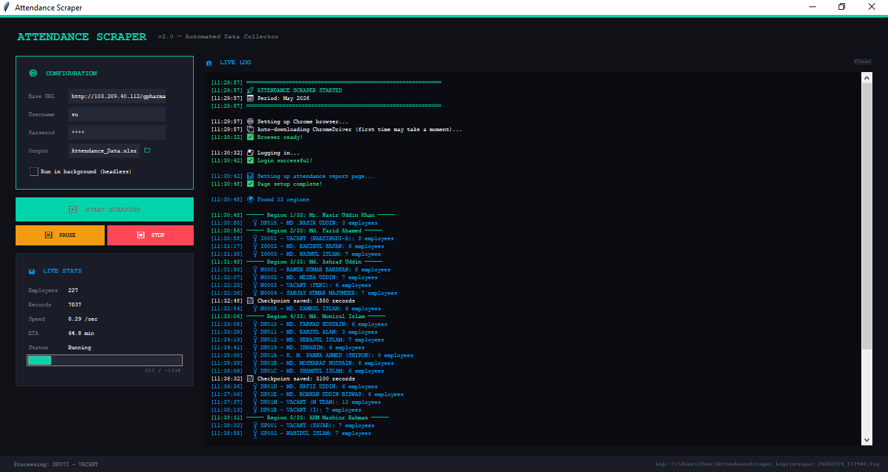

<<<<<<< HEAD
# 🕐 Attendance Scraper

A professional desktop application that **automatically collects attendance data** from a web portal for ~1338 employees and exports it to Excel. Built with Python and packaged as a standalone Windows `.exe` — no Python installation needed on target machines.



---

## ✨ Features

- 🖥️ **Professional GUI** — clean dark-themed desktop interface
- 🤖 **Fully Automated** — logs in, navigates, and scrapes all employee data
- 📊 **Live Stats** — real-time speed, ETA, employee count, and record count
- ⏸️ **Pause / Resume / Stop** — full control during scraping
- 💾 **Auto Checkpoint** — saves every 50 employees, no data loss on interruption
- 📁 **Excel Export** — outputs clean `.xlsx` file with all attendance records
- 🔧 **Auto ChromeDriver** — automatically downloads the correct ChromeDriver
- 📦 **Standalone .exe** — packaged with PyInstaller, runs on any Windows PC

---

## 🛠️ Tech Stack

| Technology | Purpose |
|---|---|
| Python 3.11 | Core language |
| Selenium | Web automation & scraping |
| Tkinter | Desktop GUI |
| BeautifulSoup4 | HTML parsing |
| Pandas | Data processing |
| OpenPyXL | Excel file export |
| webdriver-manager | Auto ChromeDriver management |
| PyInstaller | Package to .exe |

---

## 📸 Screenshot


---

## 🚀 How to Run

### Option A — Run as Python Script
```bash
pip install selenium webdriver-manager beautifulsoup4 pandas openpyxl
python attendance_scraper.py
```

### Option B — Build as .exe (Recommended)
```bash
# Just double-click:
BUILD_EXE.bat
```
The `.exe` will appear in the `dist/` folder. Copy it to any Windows PC and run!

---

## 📋 Requirements

### To run the `.exe`
- Windows 10 or 11
- Google Chrome installed
- Internet connection (first run only, for ChromeDriver download)

### To build from source
- Python 3.11+
- All packages in `requirements.txt`

---

## 📂 Project Structure

```
attendance-scraper/
├── attendance_scraper.py   # Main application (GUI + scraper)
├── BUILD_EXE.bat           # One-click build script
├── requirements.txt        # Python dependencies
├── .gitignore              # Git ignore rules
├── screenshots/            # App screenshots
└── README.md               # This file
```

---

## 📄 Output Format

The exported Excel file contains these columns:

| Column | Description |
|---|---|
| Region_Code | Employee region code |
| Region_Name | Region name |
| Area_Code | Area code |
| Area_Name | Area name |
| FME_Code | Employee ID |
| Employee_Name | Full name |
| Date | Attendance date |
| Check_In_Time | Check-in time |
| Check_Out_Time | Check-out time |
| Check_In_Location | Check-in location |
| Check_Out_Location | Check-out location |
| Period | Month and year |
| Timestamp | When data was scraped |

---

## 👨‍💻 Author

**Shihab Shahriar Kabir**
- Portfolio: [shihab-shahriar-kabir.onrender.com](https://shihab-shahriar-kabir.onrender.com)
- GitHub: [@kabir1922](https://github.com/kabir1922)
- Email: kabir1922@gmail.com
- LinkedIn: [Shihab Shahriar Kabir](https://www.linkedin.com/in/shihab-shahriar-kabir)

---

## 📜 License

This project is licensed under the MIT License.
=======
# attendance-scraper
Automated attendance data collector with GUI — Python, Selenium, Tkinter
>>>>>>> a44e63744e722674b53e6167d3c832fdc055fa3c
